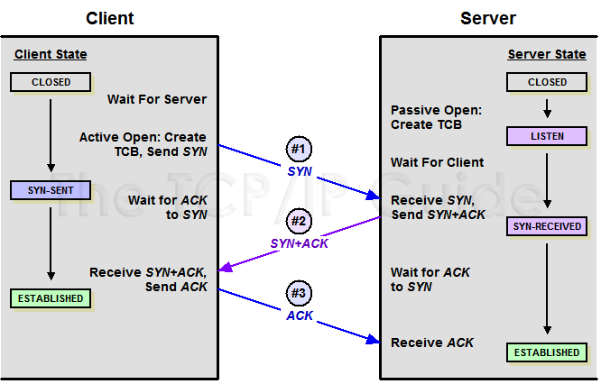
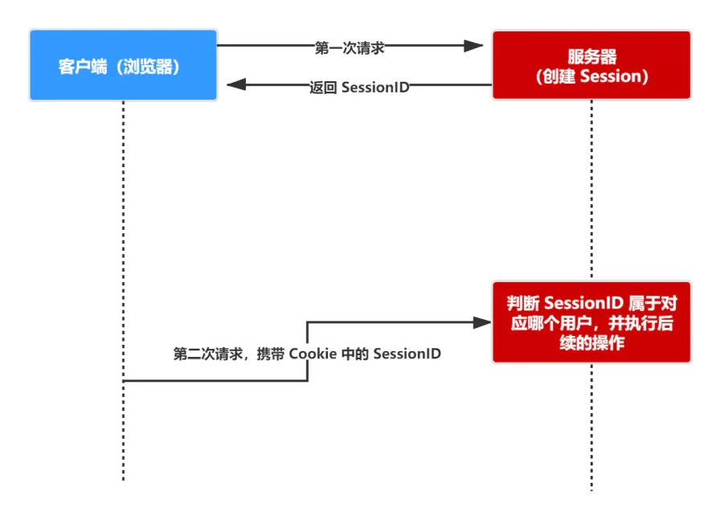

## 输入一个URL发生的全过程
1. 首先根据浏览器的多进程架构，一个页面至少需要 4 个进程，浏览器主进程、网络进程、渲染进程、`GPU` 进程

2. 浏览器通过进程间的通信（`IPC`）将 `URL` 发送给网络进程，网络进程首先查找本地是否缓存了资源，如果有直接返回，没有则走网络流程

3. 网络流程第一步，是做一个 `DNS` 域名解析，解析出域名对应服务器 ip 地址，如果是 `HTTPS` 则还需要建立 `TLS` 连接

4. 然后建立 `TCP` 连接，开始三次握手，然后开始正式发送请求

5. 请求在返回数据前，可能会经过负载均衡服务器，将请求合理地分发到对应的服务器上

6. 然后服务器返回一个响应，浏览器接收到响应，开始解析状态码，如果是 301 或者 302，则根据响应头中的 `location` 字段，进行重定向，400 或者 500 则直接显示错误，200 则继续解析

7. 浏览器根据响应头中的 `content-type` 开始解析文件，解析完后，浏览器主进程发出一个提交文档消息，让网络进程和渲染进程建立管道，将响应体中的数据发送给渲染引擎准备渲染

<br/> 


## HTTP 概述
`URL` 格式：`[Protocol]：//[hostname][:port]/[path]` 
* `Protocol`：指明获取页面的协议
* `Hostname`：指明存放 `web` 页面的服务器，可以是域名和 IP 地址
* `Port`：指明服务器的端口号，使 `HTTP` 访问服务器时，默认端口是 80，也可以指定其他端口
* `Path`：指明 `web` 页面在服务器上存放的位置

<br/> 


## 同源策略
同源是指协议，域名，端口号都相同，只要有任何一个不同，就表示是跨域，即便两个不同的域名指向同一个 ip 地址，也非同源。

<br/> 


## http 与 https
* `http`：是一个从客户端到服务端的基于 `TCP/IP` 协议上的一个应用层标准通信协议，默认端口是 80

* `https`：在 `http` 基础上采用 `SSL（安全套接字协议）/TLS（安全传输层）`进行加密传输，更加安全，默认端口是 443，要想使用 `https`，服务端必须去 CA 申请证书

从本质上来说，两者都是基于传输层协议`（TCP/IP）`上的一个应用层协议

简单点说就是：`HTTP` + 认证 + 加密 + 完整性保护 = `HTTPS`，由于 `https` 采取加密通信，所以相比较于 `http` 的纯文本传输会消耗更多的 `CPU` 资源，因为在敏感数据的请求上我们会采取 `https` 的方式进行加密处理

`http` 与 `https` 协议的缺点：
* 通信只能由客户端发起，服务端无法向客户端发起通信

<br/> 


## 常见的 http 状态码
* 200：请求成功
* 301：表示请求的资源已分配了新的 `URL`
* 302：临时重定向，表示请求的资源临时分配了新的 `URL`
* 304：浏览器执行了 `get`，但文件并未变化(服务器返回此响应时，不会返回网页内容，调用缓存内容)
* 401：请求被拒绝，需要提供授权信息
* 403：`Forbidden`，禁止访问(服务器收到请求，但是拒绝提供服务)
* 404：`Not Found`，服务器无法找到被请求的页面
* 500：服务器内部遇到错误，最常见的服务器端错误
* 503：服务不可用，可能为维护停机或超载
* 504：网关超时，服务器未能快速的做出反应，请求 `pending` 过长会导致这个

<br/> 


## get 和 post 的区别？
* `get` 请求的参数直接暴露在 `url` 上，`post` 则在 `body` 中

* 浏览器（协议本身是没有大小限制的）对 `GET` 请求参数大小有限制，大小在 2KB，`post` 理论上无限制

* `get` 请求会保存在浏览器历史记录中，数据会被浏览器主动缓存，回退时无害。`post` 请求不会被浏览器缓存，回退时会重新请求

* `get` 会把 `header` 和 `data` 一并发送出去，而 `post` 会产生两个数据包先发送 `header`，服务器返回 100，然后再发送 `data`，服务器返回 200，并不是所有浏览器都会在 `POST` 中发送两次包，Firefox 就只发送一次。

* `GET` 请求只能进行 `url` 编码，而 `POST` 支持多种编码方式。

* `GET` 只接受 `ASCII` 字符，而 `POST` 没有限制。

* 两者安全性其实并没有多大差别，不用 `https` 都是明文传输

<br/> 


## TCP的三次握手、4次挥手
### 三次握手



在 `TCP` 协议中，主动发起请求的一端为客户端，被动连接的一端称为服务端。不管是客户端还是服务端，`TCP` 连接建立完后都能发送和接收数据，所以 `TCP` 也是一个全双工（发送和请求可以同时进行）的协议。
起初，两端都为 `CLOSED` 状态。在通信开始前，双方都会创建 `TCB`。 服务器创建完 `TCB` 后遍进入 `LISTEN` 状态，此时开始等待客户端发送数据。

### 第一次握手
客户端向服务端发送连接请求报文段。该报文段中包含自身的数据通讯初始序号。请求发送后，客户端便进入 `SYN-SENT` 状态，x 表示客户端的数据通信初始序号。

### 第二次握手
服务端收到连接请求报文段后，如果同意连接，则会发送一个应答，该应答中也会包含自身的数据通讯初始序号，发送完成后便进入 `SYN-RECEIVED` 状态。

### 第三次握手
当客户端收到连接同意的应答后，还要向服务端发送一个确认报文。客户端发完这个报文段后便进入 `ESTABLISHED` 状态，服务端收到这个应答后也进入 `ESTABLISHED` 状态，此时连接建立成功。

PS：第三次握手可以包含数据，通过 `TCP` 快速打开`（TFO）`技术。其实只要涉及到握手的协议，都可以使用类似 `TFO` 的方式，客户端和服务端存储相同 `cookie`，下次握手时发出 `cookie` 达到减少 `RTT` 的目的。

### 你是否有疑惑明明两次握手就可以建立起连接，为什么还需要第三次应答？
因为这是为了防止失效的连接请求报文段被服务端接收，从而产生错误。

可以想象如下场景。客户端发送了一个连接请求 A，但是因为网络原因造成了超时，这时 `TCP` 会启动超时重传的机制再次发送一个连接请求 B。此时请求顺利到达服务端，服务端应答完就建立了请求。如果连接请求 A 在两端关闭后终于抵达了服务端，那么这时服务端会认为客户端又需要建立 `TCP` 连接，从而应答了该请求并进入 `ESTABLISHED` 状态。此时客户端其实是 `CLOSED` 状态，那么就会导致服务端一直等待，造成资源的浪费。

PS：在建立连接中，任意一端掉线，`TCP` 都会重发 `SYN` 包，一般会重试五次，在建立连接中可能会遇到 `SYN FLOOD` 攻击。遇到这种情况你可以选择调低重试次数或者干脆在不能处理的情况下拒绝请求。

### 四次挥手


### 第一次挥手
若客户端 A 认为数据发送完成，则它需要向服务端 B 发送连接释放请求。

### 第二次握手
B 收到连接释放请求后，会告诉应用层要释放 `TCP` 链接。然后会发送 `ACK` 包，并进入 `CLOSE_WAIT` 状态，表示 A 到 B 的连接已经释放，不接收 A 发的数据了。但是因为 `TCP` 连接时双向的，所以 B 仍旧可以发送数据给 A。

### 第三次握手
B 如果此时还有没发完的数据会继续发送，完毕后会向 A 发送连接释放请求，然后 B 便进入 `LAST-ACK` 状态。
PS：通过延迟确认的技术（通常有时间限制，否则对方会误认为需要重传），可以将第二次和第三次握手合并，延迟 `ACK` 包的发送。

### 第四次握手
A 收到释放请求后，向 B 发送确认应答，此时 A 进入 `TIME-WAIT` 状态。该状态会持续 `2MSL`（最大段生存期，指报文段在网络中生存的时间，超时会被抛弃） 时间，若该时间段内没有 B 的重发请求的话，就进入 `CLOSED` 状态。当 B 收到确认应答后，也便进入 `CLOSED` 状态。
为什么 A 要进入 `TIME-WAIT` 状态，等待 2MSL 时间后才进入 `CLOSED` 状态？
为了保证 B 能收到 A 的确认应答。若 A 发完确认应答后直接进入 `CLOSED` 状态，如果确认应答因为网络问题一直没有到达，那么会造成 B 不能正常关闭。

<br/> 


## 跨域
因为浏览器的安全策略，所以跨域的请求可以到达服务器，但是服务器并不会响应
常见的跨域方式：
* `JSONP`
* `CORS`
* `document.domain`
* `postMessage`

<br/> 


### JSONP
原理：页面中的 `script`、`img`、`iframe` 标签不受同源策略限制

`JSONP` 的理念就是，与服务端约定好一个回调函数名，服务端接收到请求后，将返回一段 `Javascript`，在这段  `Javascript` 代码中调用了约定好的回调函数，并且将数据作为参数进行传递。当网页接收到这段 `Javascript` 代码后，就会执行这个回调函数，这时数据已经成功传输到客户端了。

`JSONP` 的缺点是：它只支持 `GET` 请求，而不支持 `POST` 请求等其他类型的 `HTTP` 请求。

以下是 `JSONP` 的简单实现
```js
function jsonp(url, jsonpCallback, success) {
  let script = document.createElement('script')
  script.src = url
  script.async = true
  script.type = 'text/javascript'
  // 因为返回的script代码会执行我们的回调，所以我们需要把回调挂载到全局上让它调用
  window[jsonpCallback] = function(data) {
    success && success(data)
  }
  script.onerror = function() {} // 错误处理
  document.body.appendChild(script)
}
jsonp('http://xxx', 'callback', function(value) {
  console.log(value)
})
```


### CORS
浏览器会自动进行 `CORS` 通信，实现 `CORS` 通信的关键是后端。只要后端实现了 `CORS`，就实现了跨域。
服务端设置 `Access-Control-Allow-Origin` 就可以开启 `CORS`。 该属性表示哪些域名可以访问资源，如果设置通配符则表示所有网站都可以访问资源。


### document.domain
该方式只能用于二级域名相同的情况下，比如 `a.test.com` 和 `b.test.com` 适用于该方式。
只需要给页面添加 `document.domain = 'test.com'` 表示二级域名都相同就可以实现跨域


### postMessage
这种方式通常用于获取嵌入页面中的第三方页面数据。一个页面发送消息，另一个页面判断来源并接收消息
```js
// 发送消息端
window.parent.postMessage('message', 'http://test.com')
// 接收消息端
var mc = new MessageChannel()
mc.addEventListener('message', event => {
  var origin = event.origin || event.originalEvent.origin
  if (origin === 'http://test.com') {
    console.log('验证通过')
  }
})
```

<br/> 


## cookie 与 session
参考文章：
* [https://juejin.cn/post/6844903605175058439#heading-19](https://juejin.cn/post/6844903605175058439#heading-19)
* [https://juejin.cn/post/6844903842773991431](https://juejin.cn/post/6844903842773991431)
* [https://juejin.cn/post/6844904034181070861](https://juejin.cn/post/6844904034181070861)


### 为什么会产生 cookie 和 session？
因为 `http` 协议是无状态的，通信时并不能携带状态信息，但是实际应用中需要大量使用到鉴权等状态信息，所以产生了 `cookie` 和 `session`。

### cookie机制
客户端请求服务器时，如果服务器需要记录该用户状态，就使用 `response` 向客户端浏览器颁发一个 `Cookie`。而客户端浏览器会把 `Cookie` 保存起来。当浏览器再请求服务器时，浏览器会把 `Cookie` 附着在 `header` 头上一同提交给服务器。服务器通过检查该 `Cookie` 来获取用户状态。（默认情况下，`header` 都会携带 `cookie`）

对于 `cookie` 的同源策略，只关注域名是否一致，不关注协议和端口，只要域名一致即可访问到
`Cookie` 是不可跨域的；在没有经过任何处理的情况下，二级域名不同也是不行的。

### session机制
在 `session` 出现之前，大部分的网站通信都是采用的 `cookie` 进行通信

当客户端请求创建一个 `session` 的时候，服务器会先检查这个客户端的请求里是否已包含了一个 `session` 标识 - `sessionId`。如果已包含这个 `sessionId`，则说明以前已经为此客户端创建过 `session`，服务器就按照 `sessionId` 把这个 `session` 检索出来使用（如果检索不到，可能会新建一个）。如果客户端请求不包含 `sessionId`，则为此客户端创建一个 `session` 并且生成一个与此 `session` 相关联的 `sessionId`



`Session` 是基于 `cookie` 实现的。建立一个连接就生成一个 `session id`，打开几个页面就好几个了，这里就用到了 `Cookie`，把 `session id` 存在 `Cookie` 中，每次访问的时候将 `Session id` 带过去就可以识别了

根据以上流程可知，`SessionID` 是连接 `Cookie` 和 `Session` 的一道桥梁，大部分系统也是根据此原理来验证用户登录状态。

`session` 有一个缺点，如果服务器做了负载均衡，当下一个请求打到另一台服务器时，`session` 就会丢失

### cookie 和 session 的区别
有效期：`Cookie` 可设置为长时间保持，`Session` 一般失效时间较短，客户端关闭或者 `Session` 超时都会失效。
安全性：`Cookie` 存储在客户端，比较容易遭到非法获取；`Session` 存储在服务端，安全性相对 `Cookie` 要好一些。
存储大小： 单个 `Cookie` 保存的数据不能超过 4K，`Session` 可存储数据远高于 `Cookie`。但是当访问量过多，会占用过多的服务器资源。
存储值的类型：`Cookie` 只支持存字符串数据，想要设置其他类型的数据，需要将其转换成字符串，`Session` 可以存任意数据类型。

<br/> 


## ajax、fetch、axios的区别？
### ajax
缺点：多个请求之间如果相互依赖数据的话，会出现回调地狱


### fetch
`fetch` 是基于 `ES6 promise` 的一个实现，支持 `async、await`，在底层上完全重写了，根` ajax` 的 `XMLHTTPRequest`

优点：书写更加的简洁

缺点：
* 是一个很底层的 `API`，使用时还需要进行一些封装
* `fetch` 只对网络请求报错，对 400，500 都当做成功的请求，需要封装去处理
* `fetch` 不支持 `abort`，不支持超时控制
* `fetch` 默认不会带 `cookie`，需要添加配置项
* `fetch` 没有办法原生监测请求的进度，而 `XHR` 可以。


### axios
`Axios` 本质上也是对原生 `XHR` 的封装，只不过它是 `Promise` 的实现版本
优点：
* 相比 `ajax` 它支持 `promise` 化的 `API`
* 提供了一些并发请求的接口
* 支持拦截请求和响应
* 支持取消请求
* 自动转化 `JSON` 数据格式

